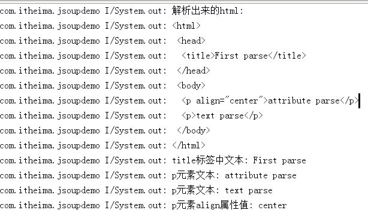
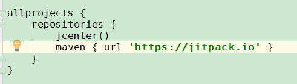

# 开源项目Jsoup使用简介

jsoup 是一款 Java 的HTML 解析器，可通过DOM，CSS选择器以及类似于JQuery的操作方法来提取和操作Html文档数据。

开源地址：[https://github.com/open-android/Jsoup](https://github.com/open-android/Jsoup "开源项目地址")

# 使用效果

## 使用步骤

### 1. 在project的build.gradle添加如下代码(如下图)

	allprojects {
	    repositories {
	        ...
	        maven { url "https://jitpack.io" }
	    }
	}

### 2. 在Module的build.gradle添加依赖
	
	compile 'com.github.open-android:Jsoup:jsoup-1.10.2'

### 3.演示步骤

* a.测试用html内容如下

		<html>
		 <head>
		  <title>First parse</title>
		 </head>
		 <body>
		  
attribute parse

		  
text parse

		 </body>
		</html>

* b.将演示代码复制到Activity的onCreate方法中

        //测试用html字符串
        String html = "<html><head><title>First parse</title></head>"
                + "<body>
attribute parse
"
                + "
text parse
</body></html>";

        //Jsoup解析获得Document对象
        Document doc = Jsoup.parse(html);

        System.out.println("解析出来的html:\n"+doc.toString());

        //获得head元素对象
        Element head = doc.head();

        //DOM方式获得第一个title元素
        Element title = head.getElementsByTag("title").first();

        //获得title元素中文本
        String text = title.text();
        System.out.println("title标签中文本: " + text);

        //---------------------------------------

        //获得body元素对象
        Element body = doc.body();

        //选择器语法查找p元素
        Elements lists = body.select("p");

        //遍历所有p元素，输出p元素文本
        for(Element p : lists){
            System.out.println("p元素文本: " + p.text());
        }

        //选择器语法查找第一个拥有align属性的p元素
        Element pElement = body.select("p[align]").first();

        //获得p元素align属性值
        String align = pElement.attr("align");
        System.out.println("p元素align属性值: " + align);

> 注意：如果解析指定url需要添加网络访问权限
> 

* 更多干货请下载app

* 欢迎关注微信公众号

